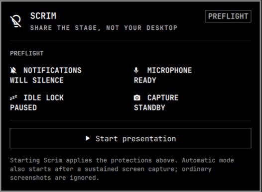
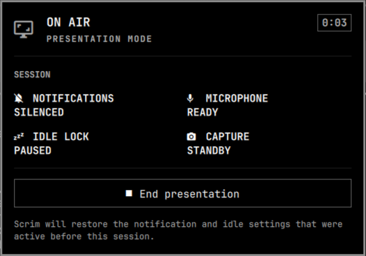

# Scrim

**Share the stage, not your desktop.**

Scrim is a privacy-aware presentation mode for Omarchy. Before a demo or
screen share, it shows what will change. While you are live, it silences
notification popups, keeps the display awake, watches capture and microphone
state, and keeps an unmistakable session timer in the bar. When you finish,
it restores the settings you had before the presentation.

| Preflight | On air |
| --- | --- |
|  |  |

## What works in 0.1.0

- Manual presentation sessions from the bar, keyboard, or CLI
- Automatic protection for sustained Hyprland screen captures
- Screenshot grace period so ordinary captures do not start a session
- Notification suppression using Omarchy's native notification service
- Idle-lock inhibition using Omarchy's native idle service
- Live capture, microphone, and elapsed-time status
- State snapshot under `$XDG_STATE_HOME` for restoration after shell restarts
- No polling, network access, elevated privileges, or extra daemon

## Install

```bash
omarchy plugin add https://github.com/e1i3or-commits/scrim.git --enable
```

Scrim targets Omarchy Quattro and uses the Hyprland, notification, idle, and
PipeWire services already provided by the stock Omarchy shell. It has no
external runtime dependencies and requires no elevated privileges.

For local development:

```bash
ln -sfn "$PWD" ~/.config/omarchy/plugins/io.github.e1i3or-commits.scrim
omarchy-shell shell rescanPlugins
omarchy plugin enable io.github.e1i3or-commits.scrim
```

The shell hot-reloads files in the user plugin directory. If a service instance
survives a rescan, use `omarchy restart shell` after service changes.

## Use

- Left-click the Scrim bar item to open preflight.
- Right-click it to immediately start or stop a presentation.
- Start and end from IPC with `omarchy-shell scrim begin manual` and
  `omarchy-shell scrim end`.
- Or run `bin/scrim start`, `bin/scrim stop`, or `bin/scrim status`.

An optional Hyprland binding can call the plugin without editing packaged
Omarchy files:

```lua
o.bind("SUPER + SHIFT + P", "Scrim presentation mode", "omarchy-shell scrim toggle")
```

## Remove

```bash
omarchy plugin remove io.github.e1i3or-commits.scrim
```

Removal does not delete the optional session-state directory. If Scrim is not
active and you also want to remove that data, delete
`$XDG_STATE_HOME/omarchy/plugins/scrim` (or
`~/.local/state/omarchy/plugins/scrim` when `$XDG_STATE_HOME` is unset).

## Safety model

Scrim snapshots the existing Do Not Disturb and idle states before it changes
them. Ending the session restores those exact values, so a machine that was
already quiet or already configured to stay awake remains that way.

The active-session snapshot is stored at:

```text
$XDG_STATE_HOME/omarchy/plugins/scrim/session.json
```

If `$XDG_STATE_HOME` is unset, Scrim uses
`~/.local/state/omarchy/plugins/scrim/session.json`.

## Roadmap

- Presenter HUD overlay with cursor spotlight and click emphasis
- Transactional clean-workspace profiles for private applications
- Multi-monitor audience/source selection
- Annotation layer and panic-hide action
- Integration providers for Omarchy Island and OmaLive

## Development

```bash
chmod +x scripts/check bin/scrim
./scripts/check
```

The repository also keeps the maintainer's optional
[named-workspace routing setup](extras/workspace-routing/README.md), including
separate TourScale and personal Chrome launchers. It is not installed by the
Scrim plugin.

## Acknowledgements

[Curtain](https://github.com/fernandomenolli/omarchy-curtain) established a
careful event-driven pattern for protecting Omarchy screen shares. Scrim has a
broader presenter-session scope and credits Curtain for demonstrating the
importance of capture tallies, screenshot grace, and exact state restoration.

## License

MIT
